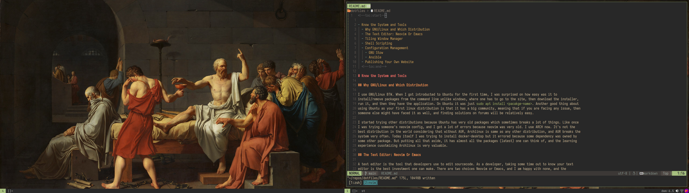
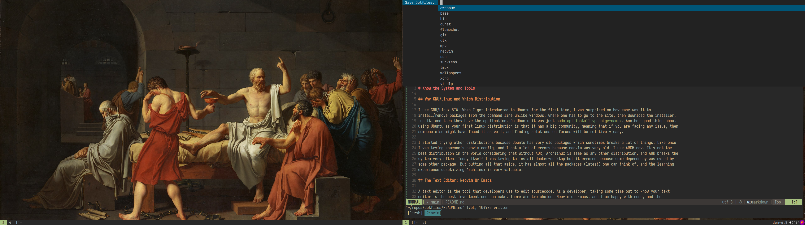

<!--toc:start-->

- [Know the System and Tools](#know-the-system-and-tools)
  - [Why GNU/Linux and Which Distribution](#why-gnulinux-and-which-distribution)
  - [The Text Editor: Neovim Or Emacs](#the-text-editor-neovim-or-emacs)
  - [Tiling Window Manager](#tiling-window-manager)
  - [Shell Scripting](#shell-scripting)
  - [Configuration Management](#configuration-management)
    - [GNU Stow](#gnu-stow)
    - [Ansible](#ansible)
  - [Publishing Your Own Website](#publishing-your-own-website)
  <!--toc:end-->

# Know the System and Tools

## Why GNU/Linux and Which Distribution

I use GNU/Linux BTW. When I got introducted to Ubuntu for the first time, I was surprised on how easy was it to
install/remove packages from the command line unlike windows, where one has to go to the site, then download the installer,
run it, and then they have the application. On Ubuntu it was just `sudo apt install <pacakge-name>`. Another good thing about
using Ubuntu as your first linux distribution is that it has a big community, meaning that if you are facing any issue, then
someone else might have faced it as well, and finding solutions on forums will be relatively easy.

I started trying other distributions because Ubuntu has very old packages which sometimes breaks a lot of things. Like once
I was trying someone's neovim config, and I got a lot of errors because neovim was very old. I use ARCH now. It's not the
best distribution in the world considering that without AUR, Archlinux is same as any other distribution, and AUR breaks the
system very often. Today itself I was trying to install docker-desktop but it errored because some dependency was owned by
some other package. But putting all that aside, it has almost all the packages (latest) one can think of, and the learning
experience cusotmizing Archlinux is very valuable.

## The Text Editor: Neovim Or Emacs

A text editor is the tool that developers use to edit sourcecode. As a developer, taking some time out to know your text
editor is the best investment one can make. There are two choices Neovim or Emacs, and I am happy with none, and the
dissatisfaction is so much that I plan to write one of my own. I use neovim (primarily) to write code, and I use emacs to
take notes, and maintain this site (not anymore). Neovim is super fast and when paired with tmux, it's a fatal solution.
Emacs on the other hand is very powerful for text editing, but it's very slow when working with large files.

I struggled to choose between the two for a long time to the point where it started affecting my work. I stopped thinking
about it anymore, and just decided on what works for the job. I still believe that If we don't have an editor as fast as
neovim, and as capable as emacs in 2024, then it's a shame. These editors are from the 80's and 90's, and things have
changed. We have new scripting languages, more capable Graphics APIs, and bigger than ever community around FOSS.

## Tiling Window Manager

Tiling Window Managers basically arrange the windows such that maximum space on the screen is utilized. There are a lot of
them, i3, DWM, awesomewm, BSPWM. With tiling window managers, you can control most aspects of your desktop windows with
keyboard shortkuts, making it very efficient, which is questionable considering how much time one spends hunting and
configuring them. I don't like desktop environments, as they are very resource heavy, and mouse driven which makes them
slow compared to tiling ones. Even then if I were to choose, I would prefer KDE over Gnome.

I have used all of the mentioned tilers at some point or the other. I used DWM for the longest time, and recently switched
to awesomewm. Awesome unlike other tiling window managers comes with really good mouse support, builtin topbar/notification
system, and has titlebars with buttons. This is how my awesomewm looks like as of writing this blog.



## Shell Scripting

One of the most rewarding things that I learnt was shell scripting. Over time I wrote quite a lot of shell scripts to automate
mundane tasks, and the best one was the bookmark script, which saves the URL of the current browser tab and the tab title
to a markdown file which I can put in a private git repository. I have over 1500 bookmarks.

```sh
# Get the focused tile info (is browser?)
focused_window_id=$(xdotool getwindowfocus)
window_title=$(xprop -id "$focused_window_id" | awk -F '"' '/^WM_NAME/{$2=$2; print $2}')
window_class=$(xprop -id "$focused_window_id" | grep "WM_CLASS" | awk '{print $4}')
...
...

if [ -n "$browser_name" ]; then
    # Run the xdotool commands
    /usr/bin/xdotool key --clearmodifiers ctrl+l key ctrl+c key Escape

    # Since we ran the xdotool commands, there has to be something on the clipboard
    clipboard=$(xclip -sel clipboard -o)

    echo "- [$window_title]($clipboard)" >> "$bookmarks_file" && \
        notify-send -r 123455 -t 800 $bookmarkImage "Bookmarks" "$window_title\n\n$clipboard"

    # Copy to primary and clipboard selections
    echo "$clipboard" | xclip -selection clipboard
    echo "$clipboard" | xclip -selection primary
fi
```

This script uses xdotool to stimulate keypresses to copy the URL and get the window title (on the windowmanager level), and then
puts them in the markdown file. it also copies the URL to the clipboards. It can be found [here](https://gitlab.com/printfdebugging/dotfiles/-/blob/main/roles/bin/files/bin/bookmark)
in my dotfiles repo.

## Configuration Management

This is my favourite topic, and it's the most frustrating part of using linux. Now when you have configured your text
editor, the tiling window manager, and other programs, you would want to save it. There are a lot of ways to do so. First
one is very simple, just put all the files/folders in a git repository, and Done! Now whenever you reinstall the system just
clone that repository, and move the files to their desired locations.

### GNU Stow

Slight upgrade to this approach would be to use some shell scripts to symlink/hardlink/copy the files to the required
places. There's a program to just do that, it's called `GNU  stow`. It creates and manages all the symlinks for you. But I
often found it broken, and I had to remove the symlinks to restow the new files. It's a nice upgrade over symlinking with
shell scripts, but it's just not enough. What about packages, will it be another shell script? What about private files like
ssh keys and .gitconfigs?

### Ansible

Ansible is a provisioning tool, which is used by system adminstrators to manage the state of the systems they are looking
after. In other words, you can specify how you want the system, and it's ansible's responsibility to maintain that
state. Make sure that you learn YAML before ansible, or else you won't understand anything. Ansible consists of playbooks,
which are a series of tasks to be performed form top to bottom, like copy this file to `.config/emacs`, or create a user named
`so-and-so`, or install these packages. This is how a task looks like. It's quite simple to understand. It says using
`community.general.pacman` modules of ansible, loop over the specified packages, and install them (more or less).

```yml
- name: install emacs packages
  tags:
    - emacs
    - packages
  community.general.pacman:
    name: "{{ item }}"
    state: latest
    extra_args: "--nodeps --noconfirm --overwrite '*'"
  loop:
    - emacs-nativecomp
    - ttf-iosevka-nerd
```

In ansible we can group tasks like installing packages and copying configuration files together into roles so that tasks
related to one thing are exected together. Ansible has a utility called `ansilbe-vault`, with which we can encrypt some file
with a password, and we can decrypt it back using that password. This is very helpful when it comes to managing ssh keys or
.gitconfigs. This is how my private ssh key looks in my dotfiles repo. So I don't have to keep it private anymore, and just
by knowing the password, I can setup my system.

```yaml
private_ssh_key_file: !vault |
  $ANSIBLE_VAULT;1.1;AES256
  37303736323131396536383363323933663436363335653061343365643832353036383035666665
  3663643136613130343266616462646633653930626434620a393533626166633130643666396336
  38653562666538346434663535333864346639343134396539616261386463663733393063373330
  ...
```

I created a script to automate the cloning process, and it's available on this site
https://printfdebugging.in/install.sh. So whenever I reinstall my system, I run the following command. After installing some
basic packages and ansible, it asks me for the passwords, and after that it's all on it's own.

```sh
curl -LO https://printfdebugging.in/intall.sh && sh install.sh
```

One issue that I faced was that whenever I make some changes in my `.configs`, I had to manually copy back the files to the
respective roles directory. This became very annoying, and to solve this issue, I wrote additional tasks, which are tagged
as `save,  save-$role`, so whenever I change anything in `.config/emacs` for example, I just run `dotfiles save-emacs`, and it
run's the save-role, which copies back the files from the respective .config directory to the role's directory.

I created a dmenu script for that. So now I just press a keybinding, and I can select the role to run save-$role task
from. Then I just go to the dotfiles repo and push the changes to gitlab.



The dotfiles can be found on my [gitlab](https://gitlab.com/printfdebugging/dotfiles.git). Special thanks to [@techdufus](https://www.youtube.com/watch?v`hPPIScBt4Gw). He was the one to inspire me to move from stow to
ansible, by showing how easy and convinient it is.

## Publishing Your Own Website

I use zola to publish my website. I have tried almost all of the static site generators, and found zola to be the best
one, as it's very well documented, it encourages the user to create their own site from scratch, and themes exist as an
alternative. I also used emacs for quite some time, and I was quite happy with the site that I created using `org-mode`
and `org-roam`, but in the end I moved to neovim because it hurts my soul to use a tool so well written which I can use
for anything except serious programming (slowness and elisp issues).

It's best if you create your own site from scratch, but if you don't have time for that, then you can
use my site. It's available [here](https://github.com/printfdebugging/printfdebugging.github.io).
