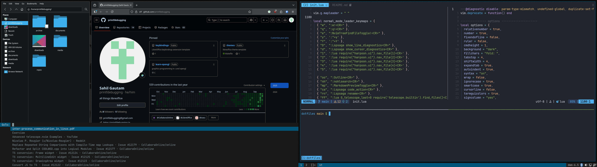

## dotfiles

it's simple. just one shell script `./package` which creates bash functions.
single file configs are stored in this repository without any folder
hierarchy (`eg. dunst, flameshot, gtk, gdb, zsh...`) and multi file configs
exist as git repositories which are cloned by the package script (eg.
[dwm], [st], [dmenu], [bin]..). please take a look into the script, it's
really simple.

[dwm]: https://gitlab.com/printfdebugging/dwm
[st]: https://gitlab.com/printfdebugging/st
[dmenu]: https://gitlab.com/printfdebugging/dmenu
[bin]: https://gitlab.com/printfdebugging/bin
